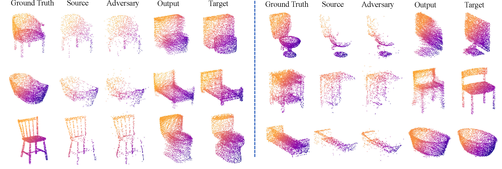

# PointCA

The official implementation of our AAAI 2023 paper "**PointCA: Evaluating the Robustness of 3D Point Cloud Completion Models against Adversarial Examples**".[[Paper](https://ojs.aaai.org/index.php/AAAI/article/view/25166)] [[arXiv](https://arxiv.org/abs/2211.12294)]

 

## Introduction

In order to evaluate the robustness of the completion models, we propose PointCA, the first adversarial attack against 3D point cloud completion models. PointCA can generate adversarial point clouds that maintain high similarity with the original ones, while being completed as another object with totally different semantic information. Specifically, we minimize the representation discrepancy between the adversarial example and the target point set to jointly explore the adversarial point clouds in the geometry space and the feature space.

Furthermore, to launch a stealthier attack, we innovatively employ the neighbourhood density information to tailor the perturbation constraint, leading to geometry-aware and distribution-adaptive modification for each point. Extensive experiments against different premier point cloud completion networks show that PointCA can cause a performance degradation from $77.9\%$ to $16.7\%$, with the structure chamfer distance kept  below 0.01. We conclude that existing completion models are severely vulnerable to adversarial examples, and state-of-the-art defenses for point cloud classification will be partially invalid when applied to incomplete and uneven point cloud data. 



## TODO

- [x] Release tensorflow version code, include attacks on [PCN](https://arxiv.org/abs/1808.00671) and [Detail Preserved PCN](https://arxiv.org/abs/2007.02374).
- [ ] Release pytorch version code, include attacks on [GRNet](https://arxiv.org/abs/2006.03761) and [VRCNet](https://arxiv.org/abs/2104.10154).

## TensorFlow Version

###  Setup

- #### Build environment

  ```shell
  cd PointCA
  # use anaconda and freeze.yml to build environment 
  conda env create -f freeze.yml -n tfgpu1.13
  conda activate tfgpu1.13
  ```
  
  There may be some failures due to channel and conda version settings. Please supplement related packages through `pip` installation. You can also use `pip` to install a new environment from scratch.
  
  ```shell
  cd PointCA
  # use anaconda to build environment 
  conda create -n tfgpu1.13 python=3.7
  conda activate tfgpu1.13
  # install packages
  pip install -r requirements.txt
  ```
  
  *Because the old TensorFlow version is deprecated and there are minor differences in diverse installation sources, you may need to try `conda` or `pip` installation multiple times to get the correct version.*

- #### Compile Customized TF Operators

  The TF operators are included under `tf_ops` and `pc_distance`, you need to compile them. Check the `makefile` under `pc_distance` folder and `compile.sh` under `tf_ops`. (You need to check the the CUDA path and tensorflow path in each  tf_xxx_compile_abs.sh under each tf_ops subfolder) first. Refer to [Pointnet++](https://github.com/charlesq34/pointnet2) and [Detail Preserved PCN](https://github.com/XLechter/Detail-Preserved-Point-Cloud-Completion-via-SFA) for more details.

- #### **Download checkpoints and assets **

  - The pretrained checkpoints is available at: [[Google](https://drive.google.com/file/d/10W6ciGw9vCSXgyt74inSN-vGrDjOZySq/view?usp=sharing)] [[Baidu](https://pan.baidu.com/s/1hrf_zVIczhlq8VZEDuCnvg)] pw:0n32, unzip the completion.zip file in ```PointCA/PointCA_TF/ckpt/completion```.

  - The victim point cloud dataset can be downloaded at: [[Google](https://drive.google.com/file/d/1JhpPLalrTQeUJJ7ub9zhqp6Vlwiorwnj/view?usp=sharing)] [[Baidu](https://pan.baidu.com/s/1HSXV51DWouUXAFhgc9lY1w)] pw:ctck, unzip the eval_pcn_modelnet10.zip file in ```PointCA/PointCA_TF/data/eval_pcn_modelnet10```. *Please note that due to the underlying distribution of the victim dataset, the batchsize in attacks can only be fixed to **5**.*

  - **The  checkpoint and model directory tree should be like this:**

    ```
    └── PointCA_TF
        ├── ckpt
        │   └── completion
        │       ├── pcn_cd
        │       └── rfa
        ├── data
        │   └── eval_pcn_modelnet10
        │       ├── attack_pc_ids.npy
        │       └── ...
        └── model
            └── completion
                ├── pcn_cd_layers.py
                ├── pcn_cd.py
                ├── rfa_layers.py
                └── rfa.py
    ```

### Quick Start

- **Launch the Geometry PointCA **

```
python model_geometry_adaptive_attack.py --knn 8 --eta 1.5 --gpu 2 # more parameters
```

- **Launch the Latent PointCA **

```
python model_latent_adaptive_attack.py --knn 8 --eta 0.8 --Lambda 20 --gpu 0 # more parameters
```

- **Other perturbation constraint baselines **

```
python model_geometry_channelwise_attack.py --epsilon 0.04 --gpu 3
python model_geometry_pointwise_attack.py --radius 0.04 --gpu 1
```

*Please modify the `model` character in command to the specific model name like `pcn`, `rfa`,  etc. Adversarial point clouds and statistical metrics will be saved in the `result` folder.*

## Acknowledge

- Some codes are built upon [OcCo](https://github.com/hansen7/OcCo) and [geometric_adv](https://github.com/itailang/geometric_adv). Thanks for their great work! If you use this code in your research, please also acknowledge their work.
- This project leverages [PCN](https://github.com/wentaoyuan/pcn), [Detail Preserved PCN](https://github.com/XLechter/Detail-Preserved-Point-Cloud-Completion-via-SFA/tree/master), [GRNet](https://github.com/hzxie/GRNet) and [VRCNet](https://github.com/paul007pl/VRCNet). We thank them for open-sourcing the code and pre-trained models.
- I honestly appreciate the help and instruction from [Xiaogeng Liu](https://sheltonliu-n.github.io/).

## BibTeX 

If you find our work helpful for your research, please consider citing the following BibTeX entry.

```
@inproceedings{hu2023pointca,
  title={PointCA: Evaluating the Robustness of 3D Point Cloud Completion Models against Adversarial Examples},
  author={Hu, Shengshan and Zhang, Junwei and Liu, Wei and Hou, Junhui and Li, Minghui and Zhang, Leo Yu and Jin, Hai and Sun, Lichao},
  booktitle={Proceedings of the Thirty-Seventh AAAI Conference on Artificial Intelligence (AAAI'23)},
  pages={872--880},
  year={2023}
}
```
